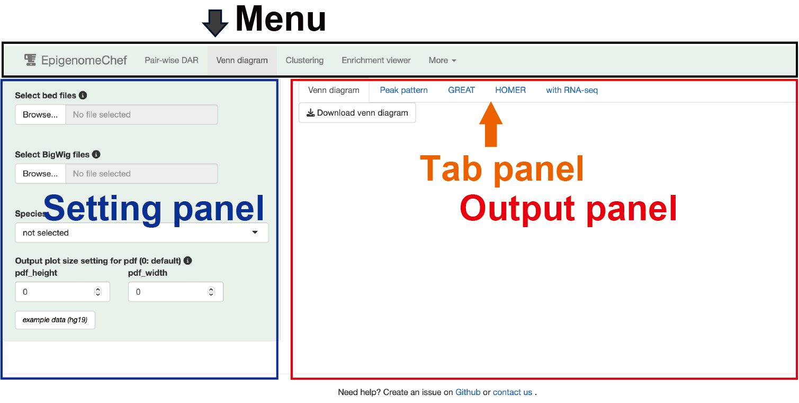
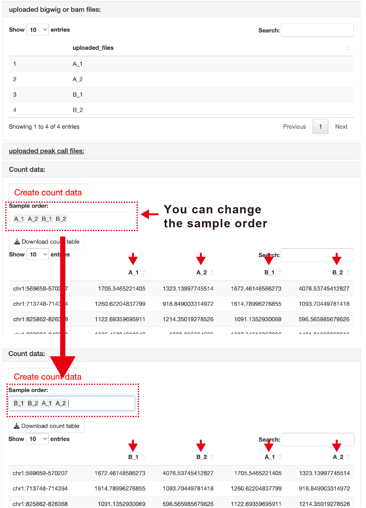
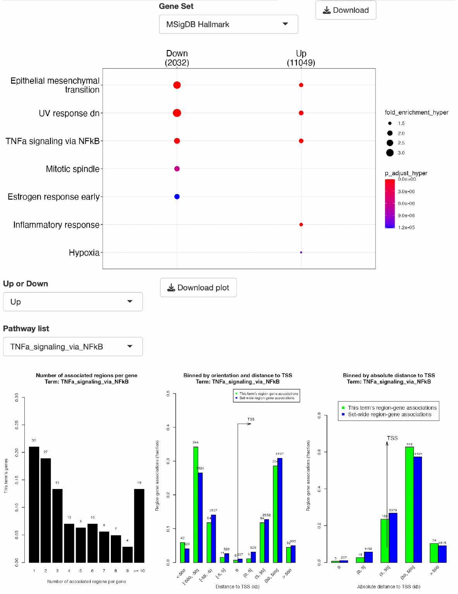
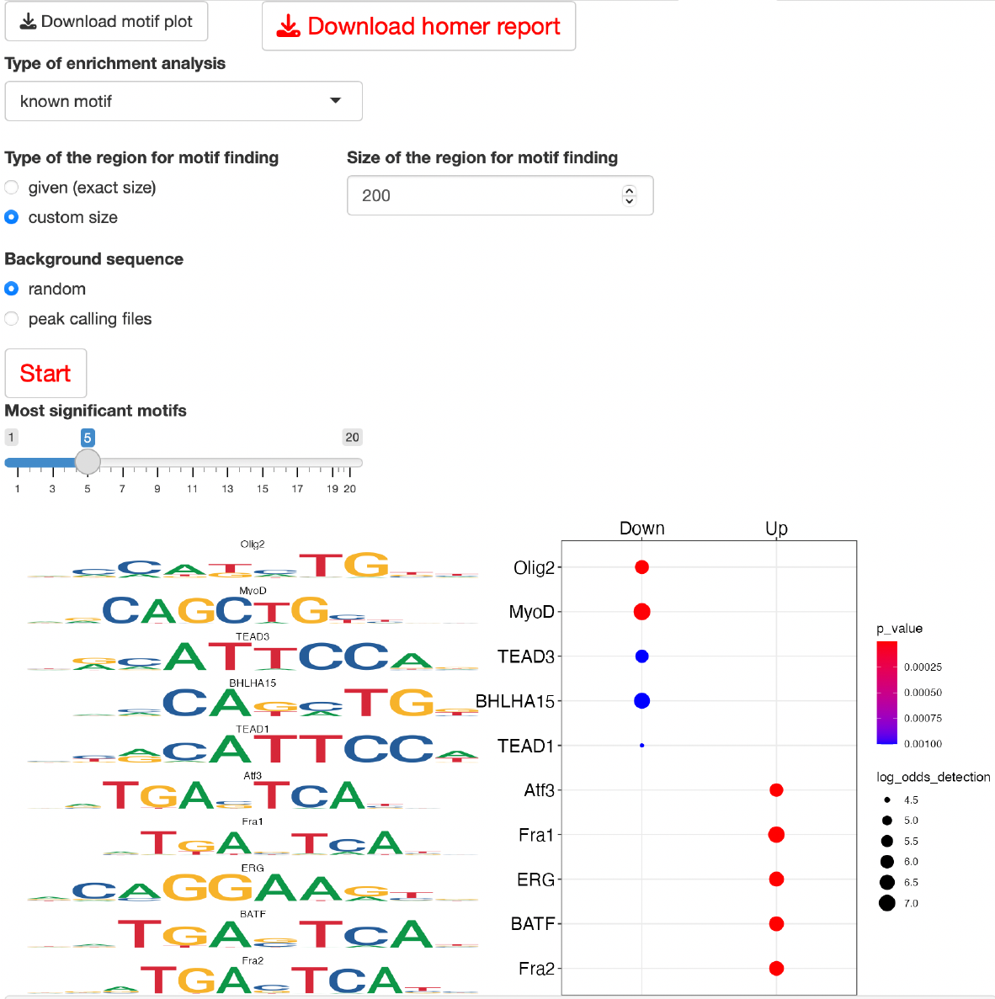
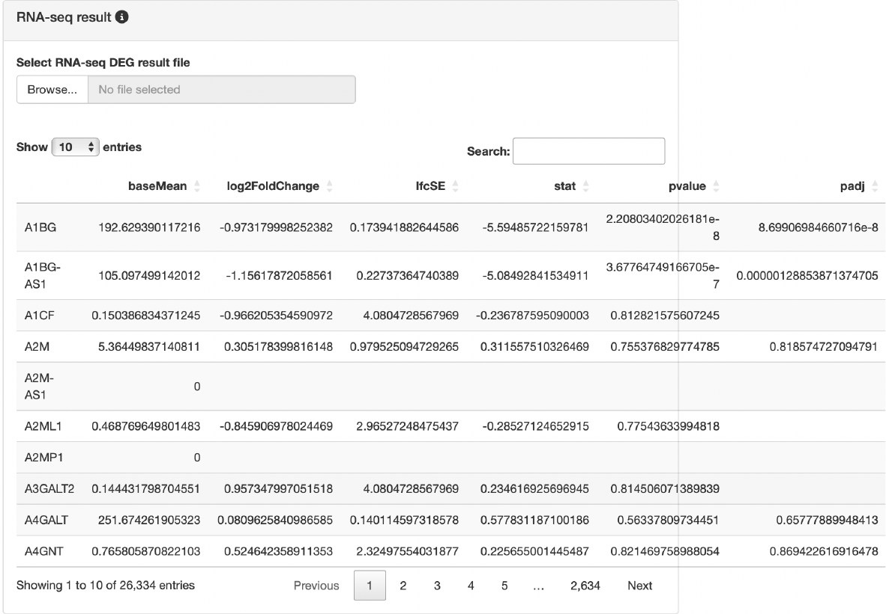
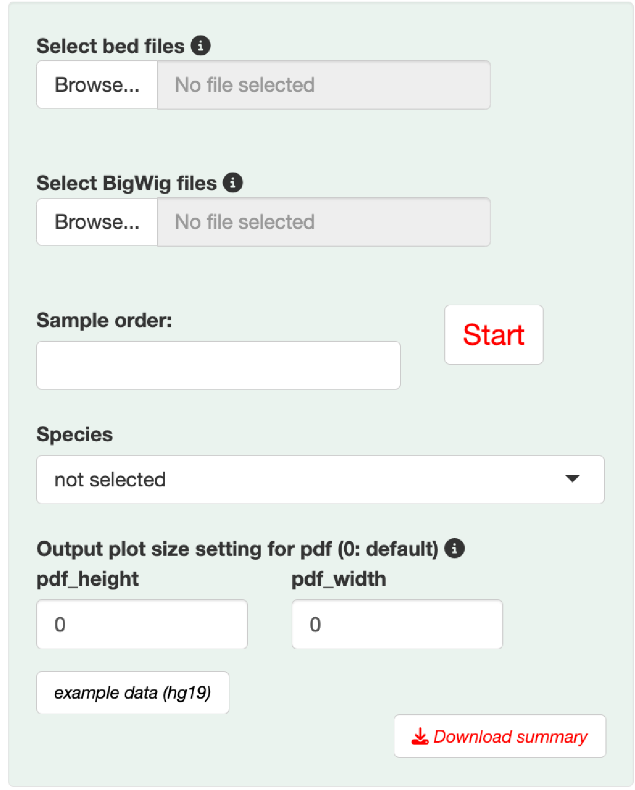
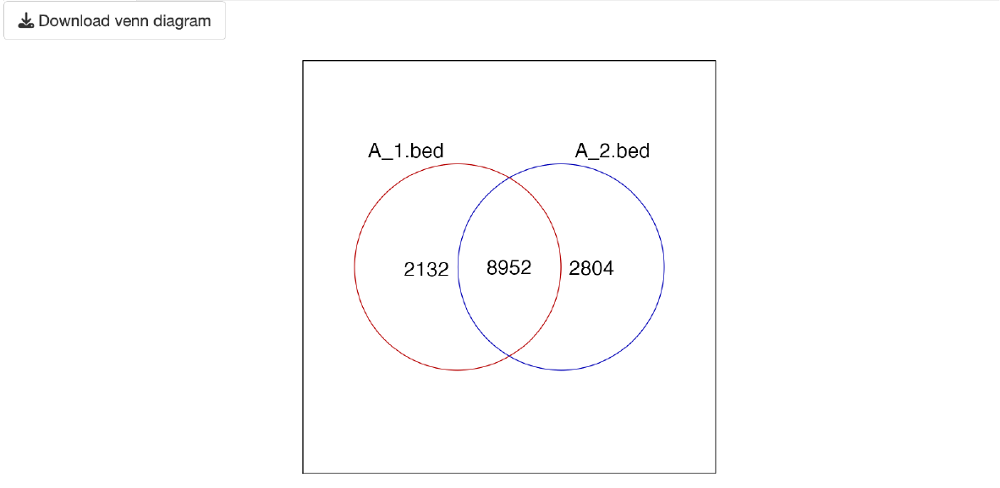
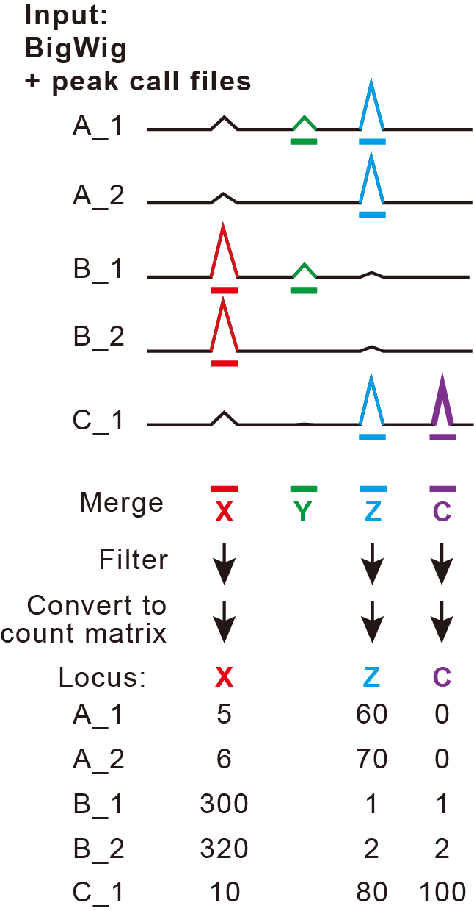
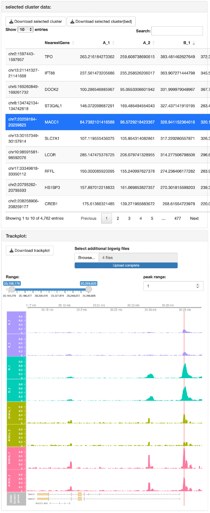
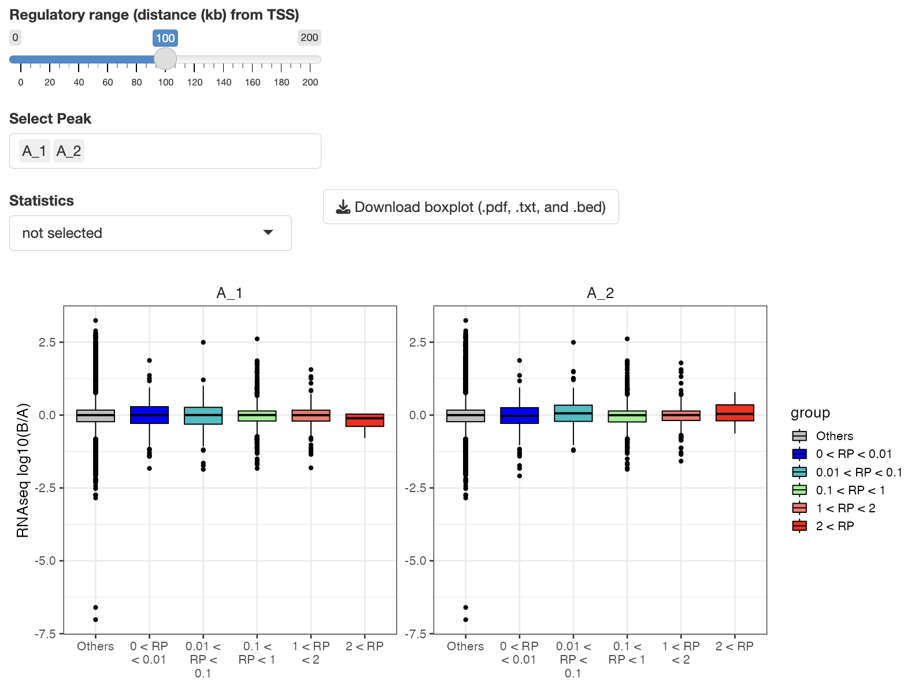

```{r setup, include=FALSE}
source("global.R")
library(Gviz)
knitr::opts_chunk$set(echo = TRUE)
```

# Outline

{#id .class width=100%} <br><br>

EpigenomeChef is a platform of systematic epigenome data analysis which can automatically detect, integrate, and visualize the epigenetic information and its interaction with transcriptome without bioinformatics skills.<br>
Data downloaded from ChIP-atlas, a database of ChIP-seq, ATAC-seq, and Bisulfite-seq, can be used as input.<br>
In addition, it easily performed the integrative analysis with transcriptome data by uploading the results file of differentially expressed gene (DEG) analysis obtained from RNA-seq data.<br>

## Install
EpigenomeChef can be used by installing the Docker image.<br>
0. (If you do not have a Docker environment) Install Docker <br>
1. Run the following command (Once you run it, you won't need it again) <br> 

HOMER mouse (mm10) (required storage size: 17Gb)
```
docker pull omicschef/epigenomechef:mm10v1.0.5-beta

## Please replace mm10 with the appropriate dataset reference.
## e.g. docker pull omicschef/epigenomechef:hg19v1.0.5-beta
```

2. Run the following command for the launch EpigenomeChef on the browser

HOMER mouse (mm10)
```
docker run --rm -p 3838:3838 omicschef/epigenomechef:mm10v1.0.5-beta

## Please replace mm10 with the appropriate dataset reference.
## e.g. docker run --rm -p 3838:3838 omicschef/epigenomechef:hg19v1.0.5-beta
```

Access [http://localhost:3838](http://localhost:3838).

If you need help, please create an issue on [Github](https://github.com/Kan-E/EpigenomeChef/issues) or [contact us](mailto:kaneto@kumamoto-u.ac.jp){.email}. <br>


EpigenomeChef consists of the following sections:<br>

- **Pair-wise** (differential accessible/binding region for pair-wise comparison)

- **Venn diagram** (Visualization of the intersections of genomic loci)

- **Clustering** (Dimension reduction for clustering, k-means clustering analysis)

- **Enrichment viewer** (Functional and motif analysis of interest of genomic loci)

- **More**（Other useful functions, Reference, etc）

To establish the versatility of EpigenomeChef, we divided its core functions into four sections, which enabled us to handle various types of input files. <br>
The user-interface consists of **Menu**, **Setting panel**, **Tab panel**.<br> Each section can be moved by clicking on a menu button.<br> The input files can be uploaded to the setting panel.<br> Epigenome analysis was started automatically by clicking the tab panel in the output panel.<br> Please explore the app’s features using example data by clicking the **example button** on the setting panel.<br><br>
{#id .class width=90%} <br>

---

# Common rules and important notice for input file

#### File extension

Coverage data:

- BigWig file (.BigWig or .bw)
- Bam file (.bam) (option for Pair-wise DAR)

Peak call data:

- narrowPeak file (.narrowPeak)
- bed file (.bed)
<br><br>

#### BigWig format

BigWig file must be normalized (e.g. Reads per million (RPM/CPM)).

#### File names of BigWig (or Bam) files

File names are used as sample names in output figures.<br>
Do not use "/", ":", and " "(space) in file names. <br>
Simple file names are recommended, as long names adversely affect creating figures. <br>
The replication number is represented by the underline “_”.<br>
Do not use the underline "_" for anything else. 

#### File names of peak call and bed files

- **Pair-wise DAR、Clustering**<br>
Any file names do not affect the analysis.<br>

- **Venn diagram、Enrichment viewer、Bedtools**<br>
File names are used as sample names in output figures.<br>
Simple file names are recommended, as long names adversely affect creating figures. <br>

#### Notes on uploading files 
Files in different folders cannot be uploaded at the same time. <br>
Put the files you want to upload at the same time in the same folder. <br>

---

# Common rules and important notice for the output file

#### saving data

The table data and graphs were saved by pressing the download button. The table data are saved as a tab-separated txt file (. txt), the data of genomic loci are saved as a bed file (.bed), and the graphs are saved as a PDF file that can be edited by Adobe Illustrator.<br> Multiple files are saved in zip format only in the **HOMER report** in the tab panel of HOMER.<br><br>

#### Adjusting the plot size

You can change the figure size by adjusting the “Output plot size setting for pdf” in the Setting panel.<br> The parameters can be adjusted when adjacent characters overlap in the graph or when the margins of the graph are too large.<br> If the value of the parameter is zero, it is saved at the default size.<br> The default size depends on the type of graph. For details, please refer to the pop-up in the application.<br><br>

---

# Pair-wise DAR

"Pair-wise DAR" detects and visualizes differentially accessible/binding regions (DAR). This function executes a series of pairwise DAR analyses such as “DAR detection”, “clustering analysis”, “Function and motif enrichment analysis (GREAT and HOMER, respectively)”, and "Integrative analysis with RNA-seq".

## Setting

{#id .class width=100%}<br>

---

### Input format

The most important parameters are the following.<br>

- **input**: "BigWig file" or "Bam file"
- **Genomic region**: "Genome-wide" or "Promoter"
- **Count file + BigWig files*

#### Input

- In the case of **BigWig file**<br>
BigWig file must be normalized (e.g. Reads per million (RPM/CPM)).<br>
The statistical analysis for pair-wise comparison depends on [limma](https://bioconductor.org/packages/release/bioc/html/limma.html). <br>

- In the case of **Bam file**<br>
Select "single-end" or "paired-end".<br>
The statistical analysis for pair-wise comparison depends on [DESeq2](https://genomebiology.biomedcentral.com/articles/10.1186/s13059-014-0550-8).<br>
In the case that the number of mapped reads in each sample is almost the same, DESeq2 analysis is more accurate than limma analysis.
On the other hand, In the case that the number of mapped reads in each sample is different, limma analysis is recommended.

- **Count file + BigWig files**<br>
This option can only be used if you have previously performed analysis using Pair-wise DAR and obtained a count file.<br>
Utilizing this mode allows you to skip the step of extracting count data from the BigWig file.<br>
**Type**: Select **Normalized count** or **Raw count** based on the conditions for which the count file was created. Choose Normalized count if the input is a BigWig file and Raw count if the input is a Bam file.<br>
Please ensure that the settings for **Genomic region** and **Filter** match the conditions used in previous analyses.<br>
If you intend to create peak patterns or track plots, you will also need to upload the BigWig file.<br>


#### Genomic region

- **Genome-wide**<br>
Peak call files are required.<br>
Upload all peak calls files corresponding to the uploaded BigWig files.<br>
To analyze the reproducible peaks, peak regions that are commonly detected in more than two files are selected, and then count data of such selected regions is created. <br>

- **Filter**<br>
**Reproducible peaks**: This mode extracts only the reproducible peak call regions for each condition (regions called as peaks in at least n = 2 conditions).<br>
For example:<br>
X: A_1 no, A_2 no, B_1 yes, B_2 yes → reproducible<br>
Y: A_1 yes, A_2 no, B_1 yes, B_2 no → NOT reproducible<br>
Z: A_1 yes, A_2 yes, B_1 no, B_2 no → reproducible<br>
In the case of X and Z genomic regions, the peak intensity is extracted and quantified from the BigWig files.<br><br>
**ALL peaks**: This mode quantifies all regions that have been called as peaks.<br>
{#id .class width=50%}<br><br>

- **Promoter**<br>
Peak call files are not required.<br>
Select the ranges of promoter region from TSS (default: upstream = 500 bp, downstream = 500 bp).<br>
Select the appropriate dataset species. <br><br>
   
Please follow the rules described in "Common rules and important notice for output file" for the file names to be uploaded.<br>

---

#### Species
The following analysis is performed by selecting the dataset species (reference).

- Analysis of promoter region
- Trackplot, peak distribution, GREAT, HOMER, with RNA-seq
<br>  
    
#### Cut-off conditions
Two types of thresholds can be set: **fold change** and **FDR**.
<br>  <br> 

---

## Output

### Input Data

The file names of uploaded files are displayed.<br> <br>
After creating the count matrix, the count data is displayed.
<br><br>
- **Sample order**<br>
You can rearrange the order of BigWig files.<br>

Please note that drag-and-drop functionality is not available. To reorder the files, delete the text, and re-enter them in the desired order for analysis.<br><br>
{#id .class width=90%}<br><br>

---

### Result overview

#### Clustering analysis, volcano plot, heatmap
Three types of clustering analyses are performed: principal component analysis (PCA), multidimensional scaling (MDS), and hierarchical clustering with the ward.D2.
<br><br>
{#id .class width=90%}<br><br>
Volcano plot and heatmap are displayed to visualize differential accessible/binding regions..<br>
If you click a genomic locus of interest in the "DAR result" table, the corresponding dot in the volcano plot becomes green.<br>

#### Trackplot panel
If you click a genomic locus of interest in the **DAR result** table, the trackplot that shows the selected locus and its nearest gene is displayed.<br>
A red highlight shown in the trackplot is the selected genomic locus.
The peak height in the trackplot can be adjusted with **peak range**.
If you want to display additional coverage data in the trackplot, you can upload the data from **select additional bigwig files**.
{#id .class width=90%}<br><br>
In the volcano plot, you can enclose regions of interest on the plot to display a table containing information solely for those genomic regions.<br>
{#id .class width=90%}<br><br>


#### Up_peaks and Down_peaks panel
The bed file of DAR is displayed.<br>
You can use the bed file as an input file for **Venn diagram**, **Clustering**, and **Enrichment viewer** sections.
<br><br>

---

### Peak distribution

The pie charts that show the annotation of up and down DAR are displayed.<br>
The following three levels of the pie chart are displayed.<br>

- **Gene Level**<br>
Promoter, Downstream, Gene body, Distal intergenic<br>

- **Exon/Intron/Intergenic**<br>
Exon, Intron, Intergenic<br>

- **Exon Level**<br>
5' UTR, 3' UTR, CDS, Other exon<br><br>
{#id .class width=90%}<br><br>

---

### Peak pattern

Peak heatmap and line plot are displayed.
The peak heatmap shows the signal intensity of each DAR peak.
The line plot shows the average signal intensity of DAR peaks.
If you want to display additional data, you can upload the data from **select additional bigwig files**.<br><br>
{#id .class width=90%}<br><br>

---

### GREAT

GREAT (Genomic Regions Enrichment of Annotations Tool)-based enrichment analysis detects the function of DARs.<br>
The following gene sets are available for analysis:<br>
[MSigDB hallmark gene](http://www.gsea-msigdb.org/gsea/msigdb/genesets.jsp?collection=H) <br>
[KEGG](https://www.kegg.jp) <br>
[Reactome](https://reactome.org) <br>
[PID (Pathway Interaction Database)](https://maayanlab.cloud/Harmonizome/resource/Pathway+Interaction+Database) <br>
[BioCarta](https://maayanlab.cloud/Harmonizome/dataset/Biocarta+Pathways) <br>
[WikiPathways](https://www.wikipathways.org/index.php/WikiPathways) <br>
[GO (biological process, cellular component, and molecular function)](http://geneontology.org)  <br>
[Human phenotype ontology](https://hpo.jax.org/app/)  <br>
[DoRothEA regulon (activator)](https://saezlab.github.io/dorothea/) <br>
[DoRothEA regulon (repressor)](https://saezlab.github.io/dorothea/) <br>
[Transcription factor targets](http://www.gsea-msigdb.org/gsea/msigdb/genesets.jsp?collection=TFT) <br>
[miRNA target](http://www.gsea-msigdb.org/gsea/msigdb/genesets.jsp?collection=MIR) <br>
note: **DoRothEA regulon** is recommended for the prediction of transcription factors.<br><br>

This analysis depends on [rGREAT](https://bioconductor.org/packages/release/bioc/vignettes/rGREAT/inst/doc/local-GREAT.html).<br><br>
{#id .class width=90%}<br><br>

---

### HOMER

HOMER (Hypergeometric Optimization of Motif EnRichment)-based motif analysis detects DNA-binding motifs enriched in DARs.<br>

#### Type of enrichment analysis
"known motif": turns off searching for de novo motifs for saving time <br>
"known + unknown motif": searching for both known and de novo motifs <br>

#### Type of the region for motif finding
"given (exact size)": Scanning the entire regions of each DAR. In the case of the analysis for the broad peaks such as histone modification, this mode is effective. <br>
"custom size": Scanning the selecting size from the peak center (default: 200). In the case of the analysis of the sharp peaks such as ATAC-seq and DNA-binding transcription factors, this mode is effective.<br>

#### Background sequence
"ramdom": Creating a background from the genome based on the GC content and scan size of the target sequences.<br>
"peak call files": Using peak regions, that exclude the analytic region, as a background. (e.g. In the case of the analysis of "up DAR", NS regions and down DAR are used as a background.) <br>
It is possible that the "peak call files" mode can predict a more specific motif rather than the "random" mode.

#### Download homer report
The folder that contains HOMER results can be downloaded.<br><br>
{#id .class width=90%}<br><br>

---

### with RNAseq
The integrative analysis with transcriptome is performed by uploading the DEG result file from RNA-seq analysis.<br>
The format of the DEG result file is the following:

- File extension: Tab-separated txt (.txt), comma-separated csv (.csv), or Excel (.xlsx) files can be accepted.
- The first column must be a gene symbol or ENSEMBL ID
- The file must contain the following columns: "log2FoldChange" and "padj"

If the file fulfills the above rules, you can use not only the result file from bulk RNA-seq but also from scRNA-seq. <br><br>
**Note**: Log2FoldChange is calculated as Log2(A/B) in the "A vs B" scenario, so "Up" corresponds to negative values. If you are using a DEG result file obtained from a source other than RNAseqChef, please pay attention to the interpretation of positive and negative values.
{#id .class width=90%}<br><br>

#### Regulatory Potential (RP)-based integrative analysis
In the case of epigenome (DAR) analysis, there are the following situations:<br>

- multiple DARs are localized near the single gene locus.
- Both up and down DAR are localized near the single gene locus.
- Single DAR is localized near the multiple gene loci

To combine epigenome information with gene expression data, it is first necessary to integrate multiple epigenetic information for each gene into a single score. This process is required for establishing the one-to-one relationship between epigenome information and gene expression for each gene.
In EpigenomeChef, the principle of **Regulatory Potential (RP)** is accepted to integrate multiple epigenetic information for each gene.<br>
RP score is calculated so that the closer the peak is to the TSS, the higher the score, and the farther from the TSS, the lower the score.<br>
The maximum distance from TSS that affect the RP score can be changed with **Regulatory range (distance (kb) from TSS)** (default: 100 kb).
The cutoff condition of DEGs from RNA-seq can be changed with **Fold change cutoff for RNA-seq data** and **FDR cutoff for RNA-seq data** (default: fold change = 1.5, fdr = 0.05).

#### Boxplot
Genes are classified with RP score (RP > 1, RP < -1, and others), and then the boxplot that shows log2FoldChange of genes in each group is displayed.<br>
Multiple-comparison test is performed by Tukey-HSD.* p<0.05, ** p<0.01, *** p<0.001<br>
This plot overviews the contribution of epigenetic alteration to gene expression change.<br>
{#id .class width=90%}<br><br>

#### Barplot
The following barplots are displayed:

- above: the classification of DEG based on RP score (up: RP > 0, NS: RP = 0, and down: RP < 0)
- below: the classification of RP > 0 (up) and RP < 0 (down) genes based on their expression levels (up DEG, down DEG, and NS)

#### KS plot

This function arranges the genes in descending order of RP score and then compares the distribution of the three groups (up DEG, down DEG, and NS).<br>
The statistic test is performed by Kolmogorov-Smirnov tests.<br>
This plot overviews the correlation between gene expression and RP score (epigenome alteration of interest).<br><br>
{#id .class width=90%}<br><br>

#### Result table panel
The result table that links epigenome analysis to transcriptome is displayed.<br>
e.g. "up-up (both upregulated genes with RNA and epigenome)" and "down-down (both downregulated genes with RNA and epigenome)". You can select it from **Group(RNA-Epigenome)**.<br>
The bed files that contain the DAR of each group can be downloaded.<br>
The downloaded bed files can be used as input files for the sections of **Venn diagram**,**Clustering**, and **Enrichment viewer**.<br>
If you click a gene of interest in the result table, the trackplot that shows the selected DAR and its nearest gene is displayed in the **Trackplot panel**.<br><br>
{#id .class width=90%}<br><br>

#### Functional enrichment analysis panel
If you can select groups of interest in the **Groups (RNAseq-Epigenome)**, functional enrichment analysis is performed.<br>
In this analysis, the enrichment analysis for the RNA-seq analysis is performed (NOT GREAT).<br>
The analysis depends on [ClusterProfiler](https://yulab-smu.top/biomedical-knowledge-mining-book/enrichplot.html).<br><br>
{#id .class width=90%}<br><br>

---

### Combined Heatmap

This function simultaneously visualizes count data and log2FoldChange values from RNA-seq, as well as the peak patterns of ChIP-seq and ATAC-seq, in a heatmap for Up and Down peaks obtained from Pair-wise DAR.<br>
Press the START button to initiate the analysis.<br><br>
{#id .class width=90%}<br><br>


---

# Venn diagram

Venn diagram detects and visualizes the overlaps of genomic loci by uploading multiple bed files. By combining it with bigwig files and a DEG result file, the peak pattern, annotation, trackplot, and correlation with transcriptome are automatically analyzed and visualized to dissect the intersection of interest.

## Setting

{#id .class width=50%}<br>

---

### Input format

#### Input

- **Bed files**<br>
Bed files must be required in this section.<br>
File names are used as sample names in output figures.<br>
Simple file names are recommended, as long names adversely affect creating figures.。<br>
**The maximum number of uploads is five**

- **BigWig files**<br>
BigWig files are required for trackplot and peak pattern including peak heatmap and line plot.
If not necessary, BigWig files are not required.

- **Sample order**<br>
You can rearrange the order of BigWig files.<br>
Please note that drag-and-drop functionality is not available. To reorder the files, delete the text and re-enter them in the desired order for analysis.<br>

---

#### Species
The following analysis is performed by selecting the dataset species (reference).

- trackplot、peak distribution、GREAT, HOMER, with RNAseq
<br>  

---

## Output

### Venn diagram

The overlap of the uploaded bed files is detected and visualized.
<br><br>
{#id .class width=90%}<br><br>

#### Lineplot of intersections (comparison between intersections)
This plot displays the average values of intersections obtained for each uploaded BigWig file. It allows you to compare peak heights within the intersection regions of a single BigWig file.

#### Lineplot of intersections (comparison between bigwig)
This plot enables you to compare the peak heights within the intersection regions for all the uploaded BigWig files.<br><br>

{#id .class width=90%}<br><br>

---

### Peak pattern

The peak pattern of the selected intersection from **Select intersect** is analyzed.<br>
The hyphen "-" means the overlap.<br>
e.g. The analysis of A.bed and B.bed<br>
A: Genomic loci of A that are not overlapped with B. <br>
B: Genomic loci of B that are not overlapped with A.<br>
A-B: Genomic loci of the overlap between A and B. <br>

#### Peak heatmap and line plot

In the case that bigwig files are uploaded, peak heatmap and line plot are displayed.<br>
If you want to display additional data, you can upload bigwig files from **select additional bigwig files**.<br>

#### Peak distribution

In the case that **Species** is selected, peak distribution is displayed.<br>
The annotation of the selected intersection is displayed.<br>
The following three levels of the pie chart are displayed.

- **Gene Level**<br>
Promoter, Downstream, Gene body, Distal intergenic<br>

- **Exon/Intron/Intergenic**<br>
Exon, Intron, Intergenic<br>

- **Exon Level**<br>
5' UTR, 3' UTR, CDS, Other exon<br><br>
{#id .class width=90%}<br><br>

#### Trackplot panel
If you click the genomic locus of interest in the **selected intersect panel**, the trackplot that shows the selected locus and its nearest gene is displayed.<br>
The red highlight in the trackplot shows the selected genomic locus.<br>
The peak height in the trackplot can be changed with **peak range**.<br>
If you want to display additional data, you can upload additional bigwig files from **select additional bigwig files**.<br><br>
{#id .class width=90%}<br><br>

#### selected intersect data panel
The table data that contains annotation of the selected intersection is displayed.<br>
The text file that contains the annotation such as the nearest genes can be downloaded.<br>
The bed file can be also downloaded.<br>
The downloaded bed files can be used as input files for using them in the section of **Clustering**、**Enrichment viewer**.<br>

---

### GREAT

GREAT (Genomic Regions Enrichment of Annotations Tool)-based enrichment analysis identifies the function of the selected intersection in the venn diagram that can be selected from **Select intersect**.<br>
The following gene sets are available for analysis:<br>
[MSigDB hallmark gene](http://www.gsea-msigdb.org/gsea/msigdb/genesets.jsp?collection=H) <br>
[KEGG](https://www.kegg.jp) <br>
[Reactome](https://reactome.org) <br>
[PID (Pathway Interaction Database)](https://maayanlab.cloud/Harmonizome/resource/Pathway+Interaction+Database) <br>
[BioCarta](https://maayanlab.cloud/Harmonizome/dataset/Biocarta+Pathways) <br>
[WikiPathways](https://www.wikipathways.org/index.php/WikiPathways) <br>
[GO (biological process, cellular component, and molecular function)](http://geneontology.org)  <br>
[Human phenotype ontology](https://hpo.jax.org/app/)  <br>
[DoRothEA regulon (activator)](https://saezlab.github.io/dorothea/) <br>
[DoRothEA regulon (repressor)](https://saezlab.github.io/dorothea/) <br>
[Transcription factor targets](http://www.gsea-msigdb.org/gsea/msigdb/genesets.jsp?collection=TFT) <br>
[miRNA target](http://www.gsea-msigdb.org/gsea/msigdb/genesets.jsp?collection=MIR) <br>
note: **DoRothEA regulon** is recommended for the prediction of transcription factors.<br><br>

This analysis depends on [rGREAT](https://bioconductor.org/packages/release/bioc/vignettes/rGREAT/inst/doc/local-GREAT.html).<br><br>
{#id .class width=90%}<br><br>

---

### HOMER

HOMER (Hypergeometric Optimization of Motif EnRichment)-based motif analysis identifies the DNA-binding motif of the selected intersection in the venn diagram that can be selected from **Select intersect**.<br>

#### Type of enrichment analysis
"known motif": turns off searching for de novo motifs for saving time.<br>
"known + unknown motif": searching for both known and de novo motifs <br>

#### Type of the region for motif finding
"given (exact size)": Scanning the entire regions of each genomic locus. In the case of the analysis for the broad peaks such as histone modification, this mode is effective. <br>
"custom size": Scanning the selecting size from the peak center (default: 200). In the case of the analysis of the sharp peaks such as ATAC-seq and DNA-binding transcription factors, this mode is effective.<br>

#### Background sequence
"ramdom": Creating a background from the genome based on the GC content and scan size of the target sequences.<br>
"peak call files": Using peak regions, that exclude the analytic region, as a background.<br>
If you click the "peak call files", the window for uploading bed files appears.
It is possible that the "peak call files" mode can predict a more specific motif rather than the "random" mode.

#### Download homer report
The folder that contains HOMER results can be downloaded.<br><br>
{#id .class width=90%}<br><br>

---

### with RNAseq
The integrative analysis of the selected intersection with transcriptome is performed by uploading the DEG result file from RNA-seq analysis.<br>
The format of the DEG result file is the following:

- File extension: Tab-separated txt (.txt), comma-separated csv (.csv), or Excel (.xlsx) files can be accepted.
- The first column must be a gene symbol or ENSEMBL ID
- The file must contain the following columns: "log2FoldChange" and "padj"

If the file fulfills the above rules, you can use not only the result file from bulk RNA-seq but also from scRNA-seq. <br><br>
{#id .class width=90%}<br><br>

#### Regulatory Potential (RP)-based integrative analysis
In the epigenome analysis, there is the case that multiple peaks are associated with a single gene.<br>
To combine epigenome information with gene expression data, it is first necessary to integrate multiple epigenetic information for each gene into a single score. This process is required for establishing the one-to-one relationship between epigenome information and gene expression for each gene.
In EpigenomeChef, the principle of **Regulatory Potential (RP)** is accepted to integrate multiple epigenetic information for each gene.<br>
RP score is calculated so that the closer the peak is to the TSS, the higher the score, and the farther from the TSS, the lower the score.<br>
The maximum distance from TSS that affect the RP score can be changed with **Regulatory range (distance (kb) from TSS)** (default: 100 kb).
The cutoff condition of DEGs from RNA-seq can be changed with **Fold change cutoff for RNA-seq data** and **FDR cutoff for RNA-seq data** (default: fold change = 1.5, fdr = 0.05).


#### Boxplot
Genes are classified with RP score (RP > 1 and others), and then the boxplot that shows log2FoldChange of genes in each group is displayed.<br>
Pair-wise comparison is performed by Welch's t-test. * p<0.05, ** p<0.01, *** p<0.001<br>
This boxplot shows the contribution of the selected intersection to gene expression.<br><br>
{#id .class width=90%}<br><br>

#### Barplot
The following barplots are displayed.

- above: the classification of DEGs based on RP scores (up: RP >0 and NS: others)<br>
- below: the classification of RP > 0 genes based on their expression levels (up DEG, down DEG, and NS)<br>


#### KS plot
This function arranges the genes in descending order of RP score and then compares the distribution of the three groups (up DEG, down DEG, and NS).<br>
The statistic test is performed by Kolmogorov-Smirnov tests.<br>
This plot overviews the correlation between gene expression and RP score (epigenome alteration of interest).<br><br>
{#id .class width=90%}<br><br>

#### Result table panel
The result table that links epigenome to transcriptome is displayed.<br>
e.g. "both upregulated genes with RNA and epigenome" and "both downregulated genes with RNA and epigenome". The table data selected from **Group(RNA-Epigenome)** is displayed.<br>
The bed file can be downloaded for using it in the section of **Clustering** and **enrichment viewer**<br>
If you click a gene of interest in the result table panel, the trackplot that shows the selected genes and genomic loci are displayed in the **trackplot panel**.<br> <br>
{#id .class width=90%}<br><br>

#### Functional enrichment analysis panel
If you can select groups of interest in the **Groups (RNAseq-Epigenome)**, functional enrichment analysis is performed.<br>
In this analysis, the enrichment analysis for the RNA-seq analysis is performed (NOT GREAT).<br>
The analysis depends on [ClusterProfiler](https://yulab-smu.top/biomedical-knowledge-mining-book/enrichplot.html).。<br><br>
{#id .class width=90%}<br><br>

---

### Combined Heatmap

This function simultaneously visualizes count data and log2FoldChange values from RNA-seq, as well as the peak patterns of ChIP-seq and ATAC-seq, in a heatmap for Up and Down peaks obtained from Pair-wise DAR.<br>
Please make sure to select the genomic regions of interest from **Select intersection** to create the heatmap.<br>
Press the START button to initiate the analysis.<br><br>

---

# Clustering

Clustering performs the clustering analysis of uploaded bigwig files.<br>
There are two purposes for this section.

- An overview of the uploaded data using PCA, MDS, dendrogram, and correlation plot that evaluates their similarity.
- k-means clustering for dissecting genomic loci of interest in detail.

## Setting

{#id .class width=50%}<br>

---

### Input format

There is an important parameter as below.<br>

- **Genomic region**: "Genome-wide" or "Promoter"

#### Genomic region

- **Genome-wide**<br>
Bed files are required.<br>
In the case that the purpose is an overview of data, the peak call files corresponding to all uploaded bigwig files are required.
(Note: there is no filtering function like Pair-wise DAR. All genomic loci in uploaded bed files are analyzed.)<br>
In the case that the purpose is a k-means clustering analysis, the bed file that is obtained from the sections of Pair-wise DAR and Venn diagram can be used.
The only genomic loci in the bed file are analyzed.<br>
(Note: The maximum number of genomic loci that can be analyzed is 10,000. )

- **Filter**<br>
Reproducible peaks: This option extracts only the reproducible peak call regions for each condition (regions called as peaks in at least n = 2 conditions). <br>
However, for samples where n = 1, all peak call regions are extracted.
例:<br>
X: A_1 no, A_2 no, B_1 yes, B_2 yes, C_1 no → reproducible<br>
Y: A_1 yes, A_2 no, B_1 yes, B_2 no, C_1 no → NOT reproducible<br>
Z: A_1 yes, A_2 yes, B_1 no, B_2 no, C_1 yes → reproducible<br>
C: A_1 no, A_2 no, B_1 no, B_2 no, C_1 yes → C is handled as reproducible since C_1 is n = 1.<br>
For X, Z, and C genomic regions, peak intensity is extracted and quantified from the BigWig files.<br><br>
**ALL peaks**: This mode quantifies all regions that have been called as peaks.<br>
{#id .class width=50%}<br><br>

- **Promoter**<br>
Bed files are not necessary.<br>
The range of promoter region can be changed (default: upstream = 500 bp, downstream = 500 bp).<br>
You can extract the promoter region of genes of interest by uploading a gene list file, and then can analyze them.<br>
Select the appropriate dataset **Species**.<br><br>
   
Please follow the rules described in "Common rules and important notice for output file" for the file names to be uploaded.<br>

---

#### Species
The following analysis is performed by selecting the dataset species (reference).

- trackplot、peak distribution、GREAT, HOMER, with RNAseq
<br>  


#### Cut-off conditions
Two types of thresholds can be set: **fold change** and **FDR**.
<br>  <br> 

---

## Output

### Input Data

The uploaded file names are displayed.<br>
After creating a count matrix, the count data is displayed.
<br><br>
- **Sample order**<br>
You can rearrange the order of BigWig files.<br>

Please note that drag-and-drop functionality is not available. To reorder the files, delete the text, and re-enter them in the desired order for analysis.<br><br>
{#id .class width=90%}<br><br>

---

### Result overview

Three types of clustering analysis are performed: Principal Component Analysis (PCA), Multi-Dimensional Scaling (MDS), and ward.D2 dendrogram.<br>
Pearson's correlation is calculated and the correlation plot is displayed.<br><br>
{#id .class width=90%}<br><br>

---

### k-means clustering

k-means clustering is performed.<br>
The number of genomic regions to be analyzed is limited to a maximum of 10,000 regions (default is 2,000 loci) due to memory constraints. You can adjust this limit using the **Most variable loci**.。<br>

- **Select a pair for fold change cut-off**<br>
Choose the two groups for which you want to apply the Fold Change cut-off.<br> 
The number of genomic regions after the cut-off is displayed in red. Please use this number as a reference to set the **Most variable loci**.<br>
- **k-means number**<br>
Set the number of clusters.<br>
- **Order of clusters on heatmap**<br>
You can change the order of clusters on the heatmap. <br>

{#id .class width=90%}<br><br>

You can analyze the clusters of interest by selecting them from **cluster_list**.<br>
In the case of selecting multiple clusters, it analyzes all clusters as the same cluster (not analyze each cluster indivisually).<br>

#### Peak pattern

Peak heatmap and line plot of the selecting cluster are displayed.<br>
If you want to display additional data, you can upload bigwig files from **select additional bigwig files**.<br>
{#id .class width=90%}<br><br>

#### Trackplot panel
If you click the genomic locus of interest in the **selected cluster panel**, the trackplot that shows the selected locus and its nearest gene is displayed.<br>
The red highlight in the trackplot shows the selected genomic locus.<br>
The peak height in the trackplot can be changed with **peak range**.<br>
If you want to display additional data, you can upload additional bigwig files from **select additional bigwig files**.<br><br>
{#id .class width=90%}<br><br>

---

### with RNAseq
The integrative analysis of the selected cluster with transcriptome is performed by uploading the DEG result file from RNA-seq analysis.<br>
The format of the DEG result file is the following:

- File extension: Tab-separated txt (.txt), comma-separated csv (.csv), or Excel (.xlsx) files can be accepted.
- The first column must be a gene symbol or ENSEMBL ID
- The file must contain the following columns: "log2FoldChange" and "padj"

If the file fulfills the above rules, you can use not only the result file from bulk RNA-seq but also from scRNA-seq. <br><br>
{#id .class width=90%}<br><br>

#### Regulatory Potential (RP)-based integrative analysis
In the epigenome analysis, there is the case that multiple peaks are associated with a single gene.<br>
To combine epigenome information with gene expression data, it is first necessary to integrate multiple epigenetic information for each gene into a single score. This process is required for establishing the one-to-one relationship between epigenome information and gene expression for each gene.
In EpigenomeChef, the principle of **Regulatory Potential (RP)** is accepted to integrate multiple epigenetic information for each gene.<br>
RP score is calculated so that the closer the peak is to the TSS, the higher the score, and the farther from the TSS, the lower the score.<br>
The maximum distance from TSS that affect the RP score can be changed with **Regulatory range (distance (kb) from TSS)** (default: 100 kb).
The cutoff condition of DEGs from RNA-seq can be changed with **Fold change cutoff for RNA-seq data** and **FDR cutoff for RNA-seq data** (default: fold change = 1.5, fdr = 0.05).

#### Boxplot
Genes are classified with RP score (RP > 1 and others), and then the boxplot that shows log2FoldChange of genes in each group is displayed.<br>
Pair-wise comparison is performed by Welch's t-test. * p<0.05, ** p<0.01, *** p<0.001<br>
This boxplot shows the contribution of the selected cluster to gene expression.<br><br>
{#id .class width=90%}<br><br>

#### Barplot
Genes are classified with RP score (RP > 1 and others), and then the boxplot that shows log2FoldChange of genes in each group is displayed.<br>
Pair-wise comparison is performed by Welch's t-test. * p<0.05, ** p<0.01, *** p<0.001<br>
This boxplot shows the contribution of the selected cluster to gene expression.<br><br>


#### KS plot
This function arranges the genes in descending order of RP score and then compares the distribution of the three groups (up DEG, down DEG, and NS).<br>
The statistic test is performed by Kolmogorov-Smirnov tests.<br>
This plot overviews the correlation between gene expression and RP score (epigenome alteration of interest).<br><br>
{#id .class width=90%}<br><br>

#### Result table panel
The result table that links epigenome to transcriptome is displayed.<br>
e.g. "both upregulated genes with RNA and epigenome" and "both downregulated genes with RNA and epigenome". The table data selected from **Group(RNA-Epigenome)** is displayed.<br>
The bed file can be downloaded for using it in the section of **Venn diagram** and **enrichment viewer**.<br>
If you click a gene of interest in the result table panel, the trackplot that shows the selected genes and genomic loci is displayed in the **trackplot panel**.<br> <br>
{#id .class width=90%}<br><br>

#### Functional enrichment analysis panel
If you can select groups of interest in the **Groups (RNAseq-Epigenome)**, functional enrichment analysis is performed.<br>
In this analysis, the enrichment analysis for the RNA-seq analysis is performed (NOT GREAT).<br>
The analysis depends on [ClusterProfiler](https://yulab-smu.top/biomedical-knowledge-mining-book/enrichplot.html).。<br><br>
{#id .class width=90%}<br><br>


---

# Enrichment viewer

Enrichment viewer performs the functional and motif enrichment analysis by uploading bed files.<br>
By using bed files from the Venn diagram and k-means clustering analysis, it detects and compares the functions and motifs of the identified intersection and clusters.
<br><br>

## Setting

{#id .class width=50%}<br>

---

### Input format

#### Input

- **Bed files**<br>
Bed files must be required.<br>
File names are used as sample names in output figures.<br>
Simple names are recommended, as long names adversely affect creating figures.<br>

---

#### Species
Selecting the appropriate dataset "Species" must be required.
<br>  

---

## Output

### Input list

The uploaded file names are displayed.
<br><br>
{#id .class width=90%}<br><br>

---

### GREAT

GREAT (Genomic Regions Enrichment of Annotations Tool)-based enrichment analysis identifies the function of the uploaded files.<br>
The following gene sets are available for analysis:<br>
[MSigDB hallmark gene](http://www.gsea-msigdb.org/gsea/msigdb/genesets.jsp?collection=H) <br>
[KEGG](https://www.kegg.jp) <br>
[Reactome](https://reactome.org) <br>
[PID (Pathway Interaction Database)](https://maayanlab.cloud/Harmonizome/resource/Pathway+Interaction+Database) <br>
[BioCarta](https://maayanlab.cloud/Harmonizome/dataset/Biocarta+Pathways) <br>
[WikiPathways](https://www.wikipathways.org/index.php/WikiPathways) <br>
[GO (biological process, cellular component, and molecular function)](http://geneontology.org)  <br>
[Human phenotype ontology](https://hpo.jax.org/app/)  <br>
[DoRothEA regulon (activator)](https://saezlab.github.io/dorothea/) <br>
[DoRothEA regulon (repressor)](https://saezlab.github.io/dorothea/) <br>
[Transcription factor targets](http://www.gsea-msigdb.org/gsea/msigdb/genesets.jsp?collection=TFT) <br>
[miRNA target](http://www.gsea-msigdb.org/gsea/msigdb/genesets.jsp?collection=MIR) <br>
note: **DoRothEA regulon** is recommended for the prediction of transcription factors.<br><br>

The analysis depends on [rGREAT](https://bioconductor.org/packages/release/bioc/vignettes/rGREAT/inst/doc/local-GREAT.html).<br><br>
{#id .class width=90%}<br><br>

---

### HOMER

HOMER (Hypergeometric Optimization of Motif EnRichment)-based motif analysis identifies DNA-binding motif enriched in each uploaded bed file.<br>

#### Type of enrichment analysis
"known motif": turns off searching for de novo motifs for saving time.<br>
"known + unknown motif": searching for both known and de novo motifs <br>

#### Type of the region for motif finding
"given (exact size)": Scanning the entire regions of each genomic locus. In the case of the analysis for the broad peaks such as histone modification, this mode is effective. <br>
"custom size": Scanning the selecting size from the peak center (default: 200). In the case of the analysis of the sharp peaks such as ATAC-seq and DNA-binding transcription factors, this mode is effective.<br>

#### Background sequence
"ramdom": Creating a background from the genome based on the GC content and scan size of the target sequences.<br>
"peak call files": Using peak regions, that exclude the analytic region, as a background.<br>
If you click the "peak call files", the window for uploading bed files appears.
It is possible that the "peak call files" mode can predict a more specific motif rather than the "random" mode.

#### Download homer report
The folder that contains HOMER results can be downloaded.<br><br>
{#id .class width=90%}<br><br>

---

### Combined Heatmap

This function simultaneously visualizes count data and log2FoldChange values from RNA-seq, as well as the peak patterns of ChIP-seq and ATAC-seq, in a heatmap for Up and Down peaks obtained from Pair-wise DAR.<br>
You must upload at least one BigWig file into **Select bigwig files (red)**.<br>
Press the START button to initiate the analysis.<br><br>

{#id .class width=90%}<br><br>

---

# More

## bedtools

Bedtools handles bed files.<br>
The file extension of input files must be in bed format (.bed or .narrowPeak).<br>
Bedtools depends on [bedtorch](https://haizi-zh.github.io/bedtorch/)<br>

### Merge interval
If the size of the adjacent regions is less than the specified size (can be changed from **Gap size**), create a file that merges the adjacent region.<br>
<br><br>
{#id .class width=90%}<br><br>

### Subtract
Subtract removes each overlapping interval in B from A.<br><br>
{#id .class width=90%}<br><br>

### Intersect
(default) Intersect reports the shared interval between the two overlapping features. <br>
(-wa option) Intersect (-wa) reports the original "A" feature when an overlap is found.<br>
(-v option) Intersect (-v) reports the "A" features that have no overlaps in "B".<br><br>
{#id .class width=90%}<br><br>


---

# Tips

## Note of data from ChIP-atlas：ChIP-seq analysis of histone modification

e.g.: Pair-wise DAR, input: samples from ATAC-seq
{#id .class width=100%}<br><br>

## HOMER: Importance of "Background sequence"

{#id .class width=100%}<br><br>

---

# Reference

Shiny framework

- Winston Chang, Joe Cheng, JJ Allaire, Carson Sievert, Barret Schloerke, Yihui
  Xie, Jeff Allen, Jonathan McPherson, Alan Dipert and Barbara Borges (2021).
  shiny: Web Application Framework for R. R package version 1.7.1.
  https://CRAN.R-project.org/package=shiny
- Eric Bailey (2022). shinyBS: Twitter Bootstrap Components for Shiny. R package
  version 0.61.1. https://CRAN.R-project.org/package=shinyBS
- Yihui Xie, Joe Cheng and Xianying Tan (2022). DT: A Wrapper of the JavaScript
  Library 'DataTables'. R package version 0.23.
  https://CRAN.R-project.org/package=DT
  
DESeq2 and limma (for differential accessibility region analysis)

- Love, M.I., Huber, W., Anders, S. Moderated estimation of fold change and dispersion for
  RNA-seq data with DESeq2 Genome Biology 15(12):550 (2014)
- Ritchie, M.E., Phipson, B., Wu, D., Hu, Y., Law, C.W., Shi, W., and Smyth, G.K. (2015). limma powers differential expression analyses for RNA-sequencing and microarray studies. Nucleic Acids Research 43(7), e47.

ggdendro (for dendrograms)

- Andrie de Vries and Brian D. Ripley (2020). ggdendro: Create Dendrograms and Tree Diagrams Using 'ggplot2'. R package version 0.1.22. https://CRAN.R-project.org/package=ggdendro

ggcorrplot (for correlation plot)

- Kassambara A (2022). _ggcorrplot: Visualization of a Correlation Matrix using 'ggplot2'_. R package version 0.1.4,
  <https://CRAN.R-project.org/package=ggcorrplot>.

rGREAT, clusterProfiler, DOSE, msigdbr, dorothea (for enrichment analysis)

- Gu Z (2022). _rGREAT: GREAT Analysis - Functional Enrichment on Genomic Regions_. https://github.com/jokergoo/rGREAT,
  http://great.stanford.edu/public/html/.
- T Wu, E Hu, S Xu, M Chen, P Guo, Z Dai, T Feng, L Zhou, W Tang, L Zhan, X Fu, S Liu, X Bo, and G Yu. clusterProfiler 4.0: A universal enrichment tool for interpreting omics data. The Innovation. 2021, 2(3):100141
- Guangchuang Yu, Li-Gen Wang, Guang-Rong Yan, Qing-Yu He. DOSE: an R/Bioconductor package for Disease Ontology Semantic and Enrichment analysis. Bioinformatics 2015 31(4):608-609
- Dolgalev I (2022). _msigdbr: MSigDB Gene Sets for Multiple Organisms in a Tidy Data Format_. R
  package version 7.5.1, <https://CRAN.R-project.org/package=msigdbr>.
- Garcia-Alonso L, Holland CH, Ibrahim MM, Turei D, Saez-Rodriguez J. 'Benchmark and integration of resources for the estimation of human transcription factor activities.' Genome Research. 2019. DOI: 10.1101/gr.240663.118.

AnnotationDbi, org.Hs.eg.db, org.Mm.eg.db (for genome wide annotation)

- Hervé Pagès, Marc Carlson, Seth Falcon and Nianhua Li (2020). AnnotationDbi: Manipulation of SQLite-based annotations in Bioconductor. R package version 1.52.0. https://bioconductor.org/packages/AnnotationDbi
- Marc Carlson (2020). org.Hs.eg.db: Genome wide annotation for Human. R package version 3.12.0.
- Marc Carlson (2020). org.Mm.eg.db: Genome wide annotation for Mouse. R package version 3.12.0.

genefilter (for z-score normalization)

- R. Gentleman, V. Carey, W. Huber and F. Hahne (2021). genefilter: methods for filtering genes from high-throughput experiments. R package version 1.72.1.

ComplexHeatmap (for heatmap and k-means clustering)

- Gu, Z. (2016) Complex heatmaps reveal patterns and correlations in multidimensional genomic data. Bioinformatics.

ggplot2 and ggpubr (for boxplot and scater plot)

- H. Wickham. ggplot2: Elegant Graphics for Data Analysis. Springer-Verlag New York, 2016.
- Alboukadel Kassambara (2020). ggpubr: 'ggplot2' Based Publication Ready Plots. R package version 0.4.0. https://CRAN.R-project.org/package=ggpubr

venn (for venn diagram analysis)

- Mitjavila-Ventura A (2022). _plotmics: Visualization of Omics And Sequencing Data In R_. https://amitjavilaventura.github.io/plotmics/index.html,
  https://github.com/amitjavilaventura/plotmics.

GenomicRanges, soGGi, ChIPQC,ChIPseeker,TxDb.Mmusculus.UCSC.mm10.knownGene, TxDb.Hsapiens.UCSC.hg19.knownGene (for manupilate genomic information and annotation)

- Lawrence M, Huber W, Pag\`es H, Aboyoun P, Carlson M, et al. (2013) Software for Computing and Annotating Genomic Ranges. PLoS Comput Biol 9(8): e1003118. doi:10.1371/journal.pcbi.1003118"
- Dharmalingam G, Carroll T (2015). _soGGi: Visualise ChIP-seq, MNase-seq and motif occurrence as aggregate plots Summarised Over Grouped Genomic Intervals_. R package version 1.10.4.
- Thomas Samuel Carroll, Ziwei Liang, Rafik Salama, Rory Stark, Ines de Santiago: Impact of artefact removal on ChIP quality metrics in ChIP-seq and ChIP-exo data. Frontiers in Genetics, in press.
- Guangchuang Yu, Li-Gen Wang, and Qing-Yu He. ChIPseeker: an R/Bioconductor package for ChIP peak annotation, comparison and visualization. Bioinformatics 2015, 31(14):2382-2383
- Lihua J Zhu, Claude Gazin, Nathan D Lawson, Herve Pages, Simon M Lin, David S Lapointe and Michael R Green, ChIPpeakAnno: a Bioconductor package to annotate ChIP-seq and ChIP-chip data. BMC Bioinformatics. 2010, 11:237
- Team BC, Maintainer BP (2019). _TxDb.Mmusculus.UCSC.mm10.knownGene: Annotation package for TxDb object(s)_. R package version 3.10.0.
- Carlson M, Maintainer BP (2015). _TxDb.Hsapiens.UCSC.hg19.knownGene: Annotation package for TxDb object(s)_. R package version 3.2.2.
- Team BC, Maintainer BP (2022). _TxDb.Hsapiens.UCSC.hg38.knownGene: Annotation package for TxDb object(s)_. R package version 3.15.0.

dplyr and tidyr (for data manipulation)

- Hadley Wickham, Romain François, Lionel Henry and Kirill Müller (2021). dplyr: A Grammar of Data Manipulation. R package version 1.0.7. https://CRAN.R-project.org/package=dplyr
- Hadley Wickham (2021). tidyr: Tidy Messy Data. R package version 1.1.3. https://CRAN.R-project.org/package=tidyr

rtracklayer, Rsubread, Rsamtools

- M. Lawrence, R. Gentleman, V. Carey: "rtracklayer: an {R} package for interfacing with genome browsers". Bioinformatics 25:1841-1842.
- Liao Y, Smyth GK and Shi W (2019). The R package Rsubread is easier, faster, cheaper and better for alignment and quantification of RNA sequencing reads.
  Nucleic Acids Research 47(8), e47.
- Morgan M, Pagès H, Obenchain V, Hayden N (2022). _Rsamtools: Binary alignment (BAM), FASTA, variant call (BCF), and tabix file import_. R package version
  2.12.0, <https://bioconductor.org/packages/Rsamtools>.

FindIT2 (for with RNAseq)

- Shang, G.-D., Xu, Z.-G., Wan, M.-C., Wang, F.-X. & Wang, J.-W.  FindIT2: an R/Bioconductor package to identify influential transcription factor and
  targets based on multi-omics data.  BMC Genomics 23, 272 (2022)

marge, ggseqlogo (for motif analysis)

- Amezquita R (2022). _marge: API for HOMER in R for Genomic Analysis using Tidy Conventions_. R package version 0.0.4.9999.
- Wagih O (2017). _ggseqlogo: A 'ggplot2' Extension for Drawing Publication-Ready Sequence Logos_. R package version 0.1,
  <https://CRAN.R-project.org/package=ggseqlogo>.
  
colorspace

- Zeileis A, Hornik K, Murrell P (2009). "Escaping RGBland: Selecting Colors for Statistical Graphics." _Computational Statistics \& Data Analysis_,
  *53*(9), 3259-3270. doi:10.1016/j.csda.2008.11.033 <https://doi.org/10.1016/j.csda.2008.11.033>.
  
bedtorch (for bedtools)

- Zheng H (2021). _bedtorch: R package for fast BED-file manipulation_. R package version 0.1.12.12, <https://github.com/haizi-zh/bedtorch>.

Gviz (for track plot)

- Hahne F, Ivanek R. Visualizing Genomic Data Using Gviz and Bioconductor. Methods Mol Biol. 1418:335-51 (2016).

---

# License
This shiny code is licensed under the GPLv3. Please see the file LICENSE.md for information.
```
EpigenomeChef
Shiny App for highlighting epigenome-transcriptome interaction.
Copyright (C) 2023  Kan Etoh

This program is free software: you can redistribute it and/or modify
it under the terms of the GNU General Public License as published by
the Free Software Foundation, either version 3 of the License, or
(at your option) any later version.

This program is distributed in the hope that it will be useful,
but WITHOUT ANY WARRANTY; without even the implied warranty of
MERCHANTABILITY or FITNESS FOR A PARTICULAR PURPOSE.  See the
GNU General Public License for more details.

You should have received a copy of the GNU General Public License
along with this program.  If not, see <http://www.gnu.org/licenses/>.

You may contact the author of this code, Kan Etoh, at <kaneto@kumamoto-u.ac.jp>
```

------------------------------------------------------------------------

# Security

This application is hosted on a [Shinyapps.io](https://www.shinyapps.io/) server.<br>
By using this app you are agreeing to the terms of use as described by Shinnyaps.io: [https://www.rstudio.com/about/shinyapps-terms-use/](https://www.rstudio.com/about/shinyapps-terms-use/).<br>
We will not save your data on our servers. However, as the Shinyapps server is not HIPAA compliant, you must refrain from uploading protected health information with this app. You can instead run the app locally on your private computer and network (see [Local installation](https://github.com/Kan-E/EpigenomeChef#local-installation)).<br>
We are not responsible for the confidentiality, availability, security, loss, misuse or misappropriation of any data you submit to this application.<br><br>
From the Shinyapps terms of use [https://www.rstudio.com/about/shinyapps-terms-use/](https://www.rstudio.com/about/shinyapps-terms-use/):If you choose to upload data to an application you are using via the RStudio Service, you acknowledge and agree you are giving certain legal rights to the licensor of the application to process and otherwise use your data. Please carefully review any license terms accompanying any application to which you submit your data for the legal rights which you are giving the application licensor. Further, RStudio does not claim ownership of your data; however, you hereby grant RStudio a worldwide, perpetual, irrevocable, royalty-free, fully paid up, transferable and non-exclusive license, as applicable, to use and copy your data in connection with making your data available to the application (and the licensor of such application) to which you have submitted your data. You acknowledge and agree that even if you remove your data from the RStudio Service, your data may have been downloaded by, and remain accessible to, the licensors of those applications to which you submitted your data. Accordingly, do not submit data which you desire to remain confidential or which you wish to limit the right to access or use. You should never submit to the RStudio Service any data which consists of personally identifiable information, credit card information, or protected health information, as such terms are defined by relevant laws, rules, and regulations. RSTUDIO IS NOT RESPONSIBLE FOR THE CONFIDENTIALITY, AVAILABILITY, SECURITY, LOSS, MISUSE OR MISAPPROPRIATION OF ANY DATA YOU SUBMIT TO THE RSTUDIO SERVICE OR ANY APPLICATION MADE AVAILABLE VIA THE RSTUDIO SERVICE.”

---

# Session info

```{r, echo = TRUE}
 sessionInfo()
```


